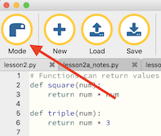
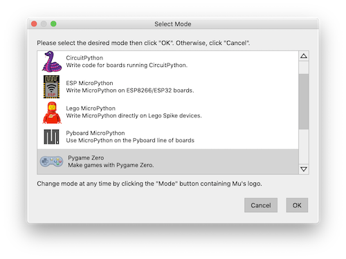
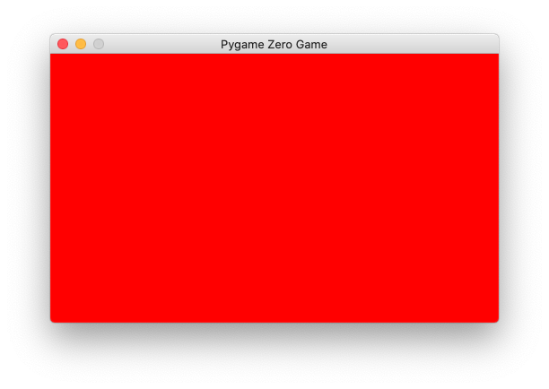
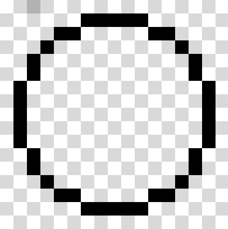
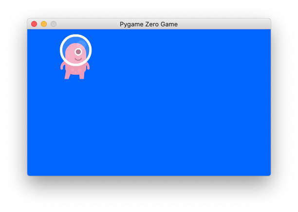
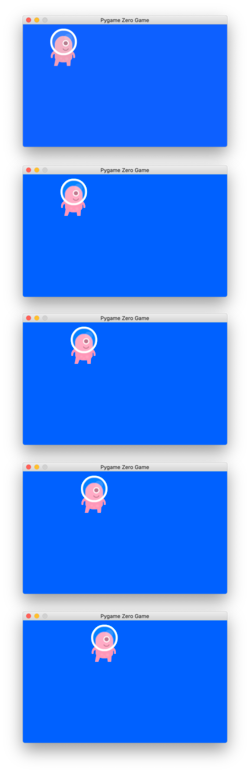
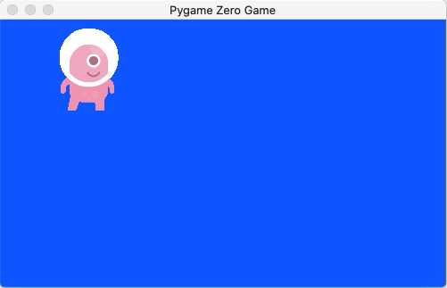

# Lesson 02

In Lesson 2, as promised, we finally started doing some actual game programming. But first, we had to learn about one more fundamental concept: functions.

After covering the basics of functions we created a simple program utilizing [PyGame Zero](https://pygame-zero.readthedocs.io/en/stable/introduction.html). We learned how to:

* Create a window of a specific width and height
* Fill the window with a background color, represented as RGB values
* Draw a sprite on the screen
* Make the sprite move across the screen

Some notes on these topics follow.

# Functions

When coding, we sometimes find ourselves needing to write the same lines of code over and over again, because our program needs to do the same things more than once. When this happens, we can of course write the same lines many times (maybe using copy and paste to make it easier for ourselves) but there is a better way!

In Python, we can use a **function** to group several lines of code together into a unit we can easily re-use wherever we need it. In the last lesson, we wrote code to ask the user their name, store the answer in a variable, and then print a greeting, using the name they entered. That code looked like this:

```
name = input("What is your name? ")
print("Hello " + name)
```

Let's say that we needed to use this code more than once in our program. We could of course copy and paste these lines wherever we needed them. Or, we could group these lines into a function, as follows:

```
def greet():
    name = input("What is your name? ")
    print("Hello " + name)
```

The first line, `def greet()` tells Python we are creating a function named `greet()`. The `def` stands for "define" - all function definitions start with this keyword. Next goes the name of the function. Next comes open and close parentheses (`()`). Don't worry about this for now - I'll explain why it's there a little later. The line ends with a colon.

Do you remember what a colon used at the end of a line means? Or what's going to come next? If you said something like "a colon means that an indented block of code is coming next", you're right! The colon indicates, that the next indented block of code goes with this line.

The intended block of code is the same code we used before. By putting it beneath the function definition like this, we are telling Python that this function is made up of these lines of code.

Having defined the function, if we were to run our program, nothing happens. Why?

Well, we've defined our function, but we have not actually used it. In programming, when we want to use a function we say we are *calling* that function. Let's call our function now - add this line after the function definition:

```
greet()
```

We call the function by writing its name followed by open and close parentheses (again, don't worry about those - I'll explain them shortly). If you run the code now, you'll see that it prompts for a name and then prints "Hello " followed by whatever name you entered.

If you wanted to do a second greeting, you could just call the function again by adding another `greet()` line. OK, so you might be wondering why bother with this? Yes, we've been able to run the code again by just adding one more line instead of repeating two lines, but is that a big deal?

In real programs, functions can contain many lines of code, sometimes even hundreds of lines. If you needed to run those lines more than once, repeating them would make your program much longer than if you just called the function again.

Note: While it's normal for functions in real programs to have maybe 10, 20, or even 50 lines of code, it's actually not a good idea for a single function to grow too big (say 100 lines or more). This isn't something you need to worry about right now, but can you think of what you'd do to make a very long function shorter?

Besides making it easier to reuse lines of code, functions have another benefit. Let's say we wanted to change something about the way we do greetings. Maybe instead of saying "Hello " followed by your name, we wanted to say "Namaste ". If we'd copied & pasted the code lines that do the greeting many times, we'd have to change this message in every copy. But if instead we'd defined a function that does the greeting and used that every time we needed to do a greeting, then we could just change the message inside the function once and that change would apply to every place the function is called.

This actually leads us to our next topic...

## Function Parameters
Let's say we did want to use our greet() function in more than one place in our code but sometimes we wanted to ask "What is your name? " and other times we wanted to ask "What are you called? ". We could of course define a second function to do the second type of greeting:

```
def greet2():
    name = input("What are you called? ")
    print("Hello " + name)
```

But notice that this function's code is exactly the same as the first `greet()` function, except for the message passed to `input()`. Rather than define a second function, there's a way to change our original `greet()` function so that we can tell it what message we want it to print when we call it.

To do that, we can change the function to take a parameter, like this:

```
def greet(message):
    name = input(message)
    print("Hello " + name)
```

Now, within the parentheses after the function name `greet`, we have the word `message`. What is `message`? It's a **parameter**. Think of it like a variable you can use inside the function. When someone calls this function, they will have to give a value for this variable. Let's look at how we'd call this version of `greet()` which takes a parameter:

```
greet("What are you called? ")
```

Inside the parentheses we put a string. This becomes the value for the `message` parameter. Wherever the code inside the function references the value of `message`, they will get this value.

Why is this helpful? Now, if you wanted to greet in one time with the message "What is your name? " you would call the function with `greet("What is your name? ")` and if later in the same program you wanted to greet with "What are you called? ", you could call the same function and just pass a different parameter value: `greet("What are you called? ")`. No need for two functions or to copy/paste the code.

Note: You might hear another word, "argument", be used in relation to parameters. Some people use "argument" and "parameter" interchangeably but technically they have different meanings. Parameters are what you write in the function definition, `message` in our case. Arguments are the values you give when you call the function, "What is your name? " or "What are you called? " in our example.

Now I'll finally explain why the original definition of `greet()` had the empty close and open parenthesis after it (`()`). You might already have guessed why. The reason is that, in a function definition, the function name is always followed by a list of parameters, enclosed with parentheses. When there are no parameters at all, as was the case in our first version of `greet()`, there is nothing between the parentheses. But we still need the parentheses there: the empty parentheses tell the Python interpreter that the function has takes no parameters.

We've now seen a function that takes no parameters and a function that takes one parameter. Of course, functions can take more than one parameter. For example, if we wanted to change greet so that both the input prompt message and the greeting string are parameters, we could write it as follows:


```
def greet(message, greeting):
    name = input(message)
    print(greeting + name)
```

This version of `greet()` takes two parameters, both enclosed within parentheses after the function's name. Instead of printing the hard-coded string "Hello ", in the greeting, we now print whatever was passed via the `greeting` parameter. Here are some sample calls to this two-parameter function:

```
greet("What is your name? ", "Hello ")
greet("What are you called? ", "Namaste ")
```

In the function call, we list parameter values one after the other, separated by commas, within the parenthesis that follow the function name.

In Python, functions can take up to 255 parameters, but in practice, you'll typically see at most 10 or so parameters for each function. A function with many more parameters than that would usually be sign of poorly organized code.

## Return Values
So far, functions have just been a useful way to group lines of code we might want to re-use. We can send values into the function via parameters. But so far, we haven't seen how to get values out of the function. We'll learn about that now.

Let's say we want to write a function to find the square of a number. As you know from math class, the square of a number is just the number multiplied by itself. In Python, we write multiplication with the asterisk (`*`) symbol rather than the `x` notation that we normally use. So we can write a function that calculates the square of a given number like this:

```
def square(num):
    num * num
```

Here we're defining a function called `square()` that takes one parameter: the number you'd like to square. Inside, it just multiples the number by itself, which is how we calculate a square.

We could call this function like this: `square(2)`. We'd be calling `square()` with the value `2` for the parameter `num`. But that wouldn't be all that useful. Yes, calling the function would make the Python interpreter compute 2 x 2, but we wouldn't be able to get our hands on the answer. Likely we'd want to print the answer or use it in another calculation. But as written, our function, though it computes the answer, doesn't give the answer back to the code that called it.

To fix this, we use a **return statement**:

```
def square(num):
    return num * num
```

This is nearly the same function definition, except that we've added the keyword `return` before the `num * num`. Now, when we call the function, it gives us a value back and we can put that in a variable and use it later in the program. For example:

```
answer = square(2)
print(answer)
```

The line `answer = square(2)` creates a variable called answer and puts in that variable the value returned from the call to `square(2)`. You can imagine that `square(2)` is replaced by the value the function returns, so that line effectively reads `answer = 4`. Once the return value is in the variable `answer`, we can use it; here's we're just printing it.

## Nesting Function Calls
Sometimes, we need to call more than one function in a row, passing the return value from the first function into the next. There's a technique called **nesting** that gives us a compact way to do this. To see it in action, let's first define another function:

```
def triple(num):
    return num * 3
```

This `triple()` function takes whatever number you give it and multiples it by 3. That's the very definition of tripling! And, of course, it returns the answer.

Let's say we wanted to start with the number 2, square it, and then triple that. We could write that as follows:

```
answer = square(2)
answer = triple(answer)
print(answer)
```

The first line calls `square()` with `2`, and puts the value returned into the variable `answer`. After this line `answer` should have the value `4`.

Next, we have an interesting line: `answer = triple(answer)`. Notice that the variable `answer` appears on both sides of the ` = `.  What's going on here? We are calling the function `triple()` and passing the value of `answer` for its parameter. After the `square(2)` call, `answer` should contain `4`. So this is basically equivalent to `triple(4)`. And the `answer =` part before the call to `triple()` means that whatever value is returned is put back in the answer variable. So at the end of this, `answer` should contain the value 12.

Having the same variable on both the left and right sides of the `=` sign is actually pretty common and perfectly acceptable. The way to think about it is that on the right side of the `=` we are using the current value of the variable. Then, we put into the variable a new value which is whatever value the expression on the right returns.

There's actually a more compact way to write the same code. Look at this:

```
answer = triple(square(2))
print(answer)
```

This is an example of nesting: we have nested the call to `square()` inside the call to `triple()`. It might be easier to think about if we put in some extra spaces:

```
answer = triple( square( 2 ) )
```

Note: I'm just writing it this way here to make it easier to explain; you shouldn't write it with these extra spaces in your code. Even though it would work, it would be considered poor coding style.

Let's start with the innermost thing, the lone `2` in the center. We're using `2` as the argument (value for the parameter) to `square()`. Then `square()` will return a value and we're using that as the argument to `triple()`.

Remember in the last section where I said that you can imagine the call to the function is replaced by whatever value the function returns?  Let's do that here:

```
answer = triple( square( 2 ) )
```

is equivalent to

```
answer = triple( 4 )
```

is equivalent to

```
answer = 12
```

Whenever you see a nested expression like this, just start from the innermost thing and start applying functions until you get to the outermost thing. This may actually look familiar! In the guessing game we wrote in Lesson 1, we had code that asked for input and converted the input to an integer. It looked like this: `int(input("Enter your guess: "))`. That's actually an example of nested function calls: we are calling the function `input()`, passing it a string prompt, and then passing what it returns to the function `int()` which returns the result converted to an integer.

Each pair of parentheses encloses one level of nesting. Notice at the end, we have two close parentheses (`))`) right after one another. For every open parenthesis, we must have a corresponding close parenthesis and since we have two open parentheses earlier, we must have two close parentheses.

Why are the the two close parentheses right next to each other? Remember that in a function call, the parentheses after a function name wrap the list of the function's arguments. The first open parenthesis after `triple` begins its argument list. Its only argument is the call to `square()` and after that call (which ends with the close parenthesis after `square()`'s argument, `2`'), we must add the close parenthesis for `triple()`'s argument list. It just so happens that this comes right after the close parenthesis for the `square()` argument list.


## Exercises

1. Given the definitions of our `square()` and `triple()` functions above, what would these function calls return?

```
triple(triple(square(2)))
square(square(square(triple(2)))
```

If you're not sure, try working it out by starting from the innermost thing, applying each function going outwards.

2. Can you write a function that returns 1 if the parameter you give it is less than 16 or 0 otherwise?

# Starting Our First Game
OK, it's finally time for us to start creating games! There are a few steps we need to do to get ready.

## Preparing to Write Game Code

First, create a new file for our game code by clicking the New button in the Mu editor toolbar (the one with the big "+" icon). Next, click the Mode button to change modes for the editor. The mode button is the one all the way to the left; it has the Mu editor logo as its icon.

<p align="center">
  
</p>

When you click that Mode button, Mu will present you with a list of modes to choose from. Select the one that says "Pygame Zero".

<p align="center">
  
</p>

Click OK. You should see two changes:
* The button in the tool bar that was previously labeled "Run" will now be labeled "Play" and its icon will look like a game controller.
* In the bottom right of the Mu editor window, next to the gear icon, it should say "Pygame Zero".

If you've done this correctly, you should be in Pygame Zero mode. This will instruct Mu to run our programs as Pygame Zero games. What is Pygame Zero? It's a Python framework for building games, designed to be easy for beginners to learn. It's perfect for this course! In this and future lessons, we'll learn all about Pygame Zero, but if you want a more concise reference to consult, you should visit the [Pygame Zero documentation](https://pygame-zero.readthedocs.io/en/stable/index.html).

Note: If you want to go back to running regular Python programs (like the ones we've run in Lesson 1 and earlier in Lesson 2 when we were learning about functions), simply hit the Mode button again and choose "Python 3" as your mode. It's no problem to switch back and forth between different modes for different programs you're writing.

## Creating the Game Window and Setting the Background Color
So far, all of our Python programs have been text based. Now we're going to start writing programs that draw graphics in a window. The first step is for us to create that window.

You should be working in a new, empty file and have switched your Mu editor's mode to Pygame Zero per the instructions in the previous section. One last thing before we get into it: what we're about to write may look strange at first. But remember, this is all just Python code and it uses the things you've already learned about. Some of those things take on special meanings when run in Pygame Zero mode, but it's all just Python. If things look scary, just take a breath and remember that you've made it this far, so you can definitely learn what comes next!

In your empty file, add the following code:

```
WIDTH = 500
HEIGHT = 300

def draw():
    screen.fill((255, 0, 0))
```

Run this by clicking the Play button in the Mu toolbar (the one that looks like a game controller). If you haven't saved your file before, you'll be prompted to do so. Then, you should see a new window pop up, filled with red. It should look something like this:

<p align="center">
  
</p>

Now let's go through the code line by line.

The first two lines create two variables, `WIDTH` and `HEIGHT` and assign them the values 500 and 300. These are just variables like others you've created in previous lessons (`name`, `age`, and so on). When you have the Pygame Zero mode enabled in the Mu editor however, these variables take on a specific meaning. They tell Pygame Zero to create a game window 500 pixels wide and 300 pixels high.

If you're unfamiliar with the term, a **pixel** is just a dot. Your computer's screen is made up of millions of little dots. Each one is so small that you can't easily distinguish one from another. But each dot, or pixel, can be set to a different color. Everything you see on your screen, from letters to buttons to icons, are made up of pixels. By making the right pixels appear in specific colors, we can make any shape appear on the screen. If you see a circle on your screen, it's not really a circle but rather a series of pixels arranged to look like a circle. If you were able to zoom in really far so that the individual pixels were big, a circle would look something like this:

<p align="center">
  
</p>

OK, back to the code. After the `WIDTH` and `HEIGHT`, we define a function, `draw()`, that takes no parameters:

```
def draw():
    screen.fill((255, 0, 0))
```

It's just a regular function, like the ones you created earlier in this lesson. Within this function is one line of code: `screen.fill((255, 0, 0))`. This might look a bit weird, so let me explain.

Let's start with the word `screen`. You might be surprised to learn that `screen` is actually a variable. You might be surprised, because you don't see `screen = ...` code that creates this variable. In fact, `screen` is one of a few special variables that Pygame Zero creates for us. It's available for us to use because we've set Mu's mode to Pygame Zero.

Now let's think about what `screen.fill` means - that probably looks a little unfamiliar. If you remember when we first learned about variables, we said that a variable is like a container. The variables we've created so far have contained things like strings and numbers. This new variable, `screen`, is still a container but it contains a new type of thing called an **object**.

We don't need to go too deeply into what objects are. Here's a simplified way to think about objects in Python that should be enough for what we need to do: an object is kind of like a group of variables and functions that describe a real thing.

For example, think about how we'd describe a person: we might list some important things about the person, like their name, age, hair color, and eye color. If we wanted to write some Python code that described a person, we might create variables like `name`, `age`, `hair_color`, and `eye_color` to hold the information about the person. We might also create some functions for the things a person could do like `speak()`, `eat()`, or `do_homework()`.

Objects give us a way to group these things together in a useful way. We can create a person object that is a grouping of the `name`, `age`, `hair_color`, and `eye_color` variables and the `speak()`, `eat()`, and `do_homework()` functions. In Python, we can store an object in a regular variable. Let's say we had a variable called `person` that stored an object representing a person. We access the variables and functions that are grouped by that object with a dot (`.`). So we'd access the person's age variable as `person.age` and we'd call the person's speak function with `person.speak()`.

So `screen` is just an object that represents the screen and `screen.fill()` refers to a `fill()` function that is part of the `screen` object. `screen.fill()` is used to fill the screen with a color. `screen.fill((255, 0, 0))` fills the screen with red.

You might be wondering how those numbers turn into red but before that, let me ask a trick question: how many parameters does `screen.fill()` take? You might have answered three, because you see three numbers within the parentheses. But in fact, the answer is 1. If you look carefully, you'll see that the three numbers are themselves wrapped in parentheses. The whole group of numbers `(255, 0, 0)` is one argument passed to `screen.fill()`.

The `(255, 0, 0)` is actually called a **tuple**. Tuples allow you to store multiple things in a single unit. Tuples don't have to contain numbers: `("banana", "apple", "orange")` is a tuple too. Tuples just give you a convenient way to group things that should always go together.

So how does `(255, 0, 0)` turn into red? All colors on your screen are made by mixing different amounts of red, green, and blue. The three numbers mean specific things:

* The first number is how much red to use.
* The second number is how much green to use.
* The third number is how much blue to use.

For each of these, 0 means "don't use any" and 255 means "use the maximum amount". Numbers in between 0 and 255 mean amounts between none and the maximum. In programming, we refer to colors represented this way as **RGB Colors**.

In our example, `(255, 0, 0)` means "the maximum amount of red, no green, and no blue". And so this results in a bright, pure red color as our background. You can try playing with different numbers in each of the three positions and see what happens to the background. You can also find many online tools that let you play with RGB values to produce colors, such as https://www.w3schools.com/colors/colors_rgb.asp. Other tools, e.g. https://www.w3schools.com/colors/colors_picker.asp, let you pick colors from a color wheel and tell you what the corresponding RGB values are.

## Drawing a Sprite on the Screen

In this section, we're going to draw a character - a little alien we'll be using in our game. You'll need to add a few lines of code to your program. The snippet below shows the whole program and the new lines are in bold:

<pre>
WIDTH = 500
HEIGHT = 300
<b>
alien = Actor('alien')
alien.pos = 100, 56
</b>
def draw():
    screen.fill(<b>0, 102, 255</b>))
<b>    alien.draw();</b>
</pre>

If you run this, you should see a little alien appear against a blue background. Like this:

<p align="center">
  
</p>

Let's go through the changed code, line by line, starting with these two lines:

```
alien = Actor('alien')
alien.pos = 100, 56
```

The first line creates a new variable, `alien`. Into that variable we put the return value from the function call `Actor('alien')`. So what is `Actor()`? It's a function that takes a string parameter and returns an actor object. In Pygame Zero, actor objects represent characters in the game (players, enemies etc.)

Note: You can basically just think of `Actor()` in the same way as any regular function. In fact, it's a special kind of function called a **constructor** but you don't have to worry about that for now.

We give `Actor()` the string `"alien"` as an argument. This is actually the name of an image file that contains a drawing of an alien. Pygame Zero comes with a few image files like this we can just use. Later we'll see how to create our own images to use in our games. Small images like the alien which are designed to be used as characters in a game are called **sprites**.

In summary `alien = Actor('alien')`:
* Creates a variable called alien which stores a new actor object.
* The actor object is created with the name of an image file containing a drawing of an alien.

The next line `alien.pos = 100, 56` sets the alien's position on the screen. Remember the discussion about how we refer to variables in an object with a dot; that's what we are doing here. `pos` is a variable within the actor object stored in `alien` that stores the position in the screen. Position is another tuple, similar to the ones we saw before for colors, but with only two elements. The two elements of the tuple are x and y coordinates. Here we're saying that the alien should be positioned at 100 along the x-axis and 56 along the y-axis.

In Pygame Zero windows, the coordinate 0, 0 is situated at the top-left of our window. The x-coordinates get larger as you move to the right. The y-coordinates get larger as you move down. Since our window is 500 pixels wide by 300 pixels high, the coordinates of the bottom right pixel are 499, 299 (not 500, 300 because we start counting coordinates from zero).

By placing our alien at 100, 56, we're putting it about a fifth of the way across the screen and about a sixth of the down the screen. The coordinate we give to `alien.pos` refers to the center of the sprite.

The next changed part of the code is the numbers in the tuple passed to `screen.fill()`. By using `(0, 102, 255)` we get a medium blue background that makes the alien show up well.

The last thing we've done is add a line to the `draw()` function: `alien.draw()`. We're using the dot to refer to the draw function on the actor object stored in the variable `alien`. Calling the draw function on an actor object causes that actor's sprite to be drawn at whatever position is set in that object's `pos` variable. By calling `alien.draw()` within our `draw()` function, the alien sprite gets drawn when our game runs.

## Making the Sprite Move Across the Screen

Think back to when we first introduced functions, and we defined a `greet()` function in our code but did not call it - nothing happened. Looking at this code, you might notice that though we've defined a `draw()` function, we never call it. So why does our program draw anything at all?

The answer is that Pygame Zero automatically calls our `draw()` function for us. Actually, it calls our `draw()` function many times over: 60 times per second, in fact. We can't tell this is happening yet: our draw function draws the same thing every time it's called so the screen doesn't look any different whether it's called once or 60 times per second.

Our `draw()` function being called 60 times per second is what allows us to make the characters in our game move. In this section we're going to make the alien move across the screen. To be more accurate, we're going to make it *look* like the alien is moving across the screen.

What we'll do is draw the alien at slightly different positions on the screen each time our `draw()` function is called. Because `draw()` is called over and over again so rapidly, each individual drawing will flash before our eyes so quickly that it'll look to us like the alien is moving. This is the same trick used to animate cartoons in TV shows and films.

What's actually happening is that we'll draw a series of still images like these, one after the other:

<p align="center">
  
</p>


In reality, the difference in the alien's position from one to the next will be much smaller than what I've shown here. And when they're drawn at the rate of 60 per second, it will look like smooth movement.

To make this happen, we need to write another function called `update()`:

```
def update():
    alien.left += 2
```

Like `draw()`, `update()` is another special function that Pygame Zero recognizes. If you program contains an `update()` function, then Pygame Zero will call it right before it calls `draw()` each time. The sequence of function calls will be: `update()`, `draw()`, `update()`, `draw()`, ... 60 times per second. In the `update()` function, you can change the position of the sprites on the screen. Then, the next time `draw()` is called, it will draw them in a different spot.

Note: Remember, both `draw()` and `update()` are called automatically by Pygame Zero. You just need to define the functions. You never need to call them yourself.

The define function written above contains one line of code: `alien.left += 2`. This line changes the x-coordinate of the left side of the alien sprite by two pixels each time it's called. `alien.left` refers to the `left` variable on the actor object stored in the `alien` variable and contains the x-coordinate of the sprite's left side. In Python, the operator `+=` means "take what's currently in the variable on the left and add to it what's on the right". So in this case, Python takes whatever value `alien.left` has and adds two to it.

So every time `update()` runs, the x-coordinate stored in `alien.left` increases by 2. Then, when `draw()` draws the alien, it will draw it in its new place. Along the x-axis, bigger values are to the right, so this makes it look like the alien is moving to the right.

Run your program now and see what happens! You should see the alien moving smoothly to the right on the screen. But, oh no! It goes off the right side of the screen and never comes back. Can you think of a reason why this is happening?

The problem is that we keep adding to `alien.left` and so it gets bigger and bigger, eventually positioning the alien at an x-coordinate larger than the width of the window! Pause here and think about what you might do to fix it.

What we want is to detect when we've increased `alien.left` so much that it's bigger than the width of the screen. We can use an if-statement for that. Change your definition of `update()` to look like this (the new code is shown in bold):

<pre>
def update():
    alien.left += 2
    <b>if alien.left > WIDTH:
        alien.right = 0</b>
</pre>

We've added an if-statement that checks whether `alien.left` is bigger than the value in the `WIDTH` variable (which we created earlier and set to 500). If so, we set `alien.right` which is the variable representing the x-coordinate of the sprite's right side, to zero. This will position the alien just off the screen at the left side and when `update()` runs, it will start moving to the right. This will give the appearance of the alien re-entering the screen from the left-hand side.

Run the program again and now you should see the alien move to the right and then re-enter the screen from the left side. Pretty cool!

Remember, the movement is just an illusion created by drawing lots of still images really fast. To show you how many images are actually drawn, I wrote a version of the program that doesn't clear the screen before re-drawing the alien each time and then recorded this animation:

<p align="center">
  
</p>

This should give you a feel for how many times Pygame Zero is drawing your alien.

Note: Your program shouldn't look like this animation - I just created this for illustration purposes. When you run your program, you should see a single alien moving across the screen.

## Exercises

1. Change the background color of the game window to something else that looks good to you.

2. Make the alien move to the left instead of to the right.

3. Bonus challenge: can you make the alien move up or down instead of left or right?


