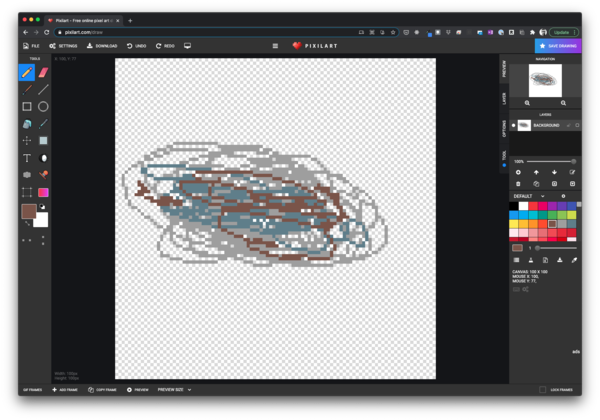
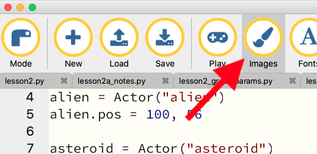
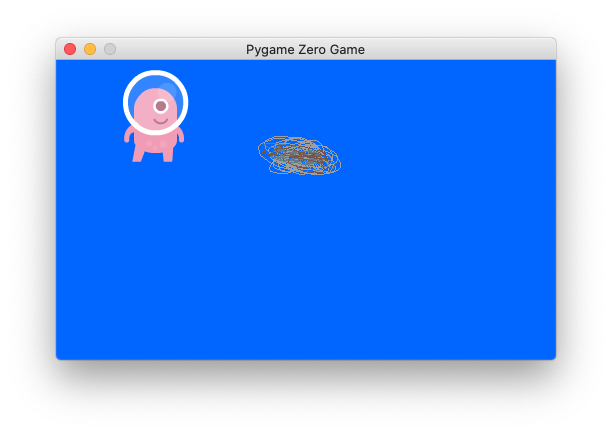

# Lesson 03

In Lesson 3, we made our game respond to keyboard input and created a simple interaction between our player character and another element in the game. We didn't learn any new programming concepts in this lesson, but we did re-use what we learned in previous lessons about variables, functions, and if-statements.

Here's what we learned to do:
* Make our alien character move when the player presses the up and down arrow keys.
* Add an asteroid to the game, using a sprite we designed ourselves.
* Detect collisions between the alien and the asteroid.
* Change the appearance of the alien.
* Play sounds.
* Make something happen after a specified amount of time.

Some notes on these topics follow.

# Keyboard Input

At the end of our last lesson, we had implemented code that moves the alien across the screen, over and over. This movement was automatic; the player had no control over it. In real games, while you might have some elements or characters that move automatically, usually the player will be able to control at least one character. In our game, we'll write the code that will allow the player move the alien using their keyboard's arrow keys.

At the end of the last lesson, the game code looked like this:

```
WIDTH = 500
HEIGHT = 300

alien = Actor("alien")
alien.pos = 100, 56

def draw():
    screen.fill((0, 102, 255))
    alien.draw()

def update():
    alien.left += 2
    if alien.left > WIDTH:
        alien.left = 0
```

The `update()` function, Pygame Zero calls before it draws each frame, changes the position of the alien. This is how we implemented movement. To start this lesson, make a copy of this code in a new file, and then delete the `update()` function entirely. We'll eventually bring a different form of `update()` back, but for now we want to remove it. The starting code for this lesson should look like this:

```
WIDTH = 500
HEIGHT = 300

alien = Actor("alien")
alien.pos = 100, 56

def draw():
    screen.fill((0, 102, 255))
    alien.draw()
```

If you were to run this, you should see the alien but it won't move: without an `update()` function, its position never changes, so `draw()` draws it in the same spot every time.

Now, let's add some code that will let the player move the alien up and down with the up and down arrow keys. Create a new, function `on_key_down()` as follows:

```
def on_key_down(key):
    if key == keys.DOWN:
        alien.top += 10
```

`on_key_down()`, like `update()` and `draw()`, is another special function that Pygame Zero recognizes. If this function is defined in your program, Pygame Zero will call it whenever the player presses a key on the keyboard. `on_key_down` takes one parameter, `key`. This parameter will receive a value that you can use to determine which key was pressed.

In our implementation of `on_key_down()`, we are checking whether the `key` parameter is equal in value to `keys.DOWN`. Let me break this down:
* `key` is the parameter passed to `on_key_down`
* We compare it using the `==` operator. Notice that there are *two* equals signs: this is the way we express the concept of "is equal to". It's different from the single equals sign we use to assign a value to a variable `alien = Actor("alien")`.
* The thing we compare to is `keys.DOWN`. `keys` is another built-in object in Pygame Zero. Remember from the last lesson that we said an object is a grouping of certain variables and functions. The `keys` object contains a variable for each key on the keyboard. You can find a full list of these in the [Buttons and Keys section of the Pygame Zero documentation](https://pygame-zero.readthedocs.io/en/stable/hooks.html#buttons-and-keys). The value in `keys.DOWN` is the value representing the down arrow key.

You don't need to worry too much about what the actual value of the key parameter is (though if you were curious you could print it by a `print(key)` statement inside the function) or what value is stored in `keys.DOWN` (or any other variable in `keys`). It's just useful to be able to compare them to one another to see if the key pressed was a key you expected. In our `on_key_down()` we are comparing `key` to `keys.DOWN` to check if the down arrow key was pressed.

If the down arrow key was pressed, we add 10 to the `alien.top` variable. Run the program and try it out. When you press the down key, the alien should move down the screen. You can press it repeatedly to have the alien move multiple times. Why does *adding* to `alien.top` move the alien down? The answer is that `alien.top` represents the y-coordinate of the top of the alien and along the y-axis, 0 is at the top and values increase as you go down.

Note: In teaching this lesson, one point of confusion arose that we should clear up: Pygame Zero calls `on_key_down()` for *any* key pressed on the keyboard. If you pressed, say, the space bar, Pygame Zero would call `on_key_down()` with a value for `key` that equaled `keys.SPACE`. The word "down" in the function name refers not to the down arrow key, which we happen to be looking for, but to the action of pressing a key downwards. When you press a key on the keyboard, there are distinct events for the downward press of the key and then the release of the key back up. If you were interested in when a key is released, you could implement `on_key_up()` in your program and Pygame Zero would call it when any key was released.

OK, as is, we can move the alien down, but we have no way to move it up. Think for a moment about how you might implement this. We'd want the alien to move up when the up arrow key is pressed. Pressing the up arrow key will also result in Pygame Zero calling `on_key_down()` but the value of `key` will equal `keys.UP`. We can extend our code to check for this by adding an `elif` clause:

<pre>
def on_key_down(key):
    if key == keys.DOWN:
        alien.top += 10
    <b>elif key == keys.UP:
        alien.top -= 10</b>
</pre>

Remember, `elif` is short for "else if". So if the first condition `key == keys.DOWN` isn't met, we'll check if `key == keys.UP`. If so, we move subtract 10 from `alien.top` using the `-=` operator (which is the analog of the `+=` operator we've seen before; it just subtracts from whatever value is currently in the variable on the left). Because, along the y-axis, smaller values are higher up, subtracting 10 moves our alien up the screen.

Run the program and play with this. You may notice we have a bit of a problem: you can move the alien off the screen, either on the bottom or top of the window. We're not going to fix that now but it is one of the exercises you can try. Think about how we dealt with the alien moving off the side of the screen in the last lesson. Can you implement something similar to not let the alien go off the top or the bottom of the screen?

## Creating an Asteroid Sprite
In this section, we're going to add an asteroid to our game. The first thing we need to do is create the image we're going to use for the asteroid. When we created the alien, we didn't have to do this step because Pygame Zero comes with an alien image we can use. But there's no built-in asteroid image, so we'll have to create one.

You can use any sprite editor for this task. If you don't already have a favorite sprite editor, I suggest using pixilart.com, an online sprite editor. Visit https://www.pixilart.com/draw in your browser to start using it.

The pixilart interface offers a number of drawing tools you can use. Later, you can spend time experimenting and learning these so that you can create more sophisticated sprites. For now, we're going to create a very rough drawing, so all you need is the Pencil Tool, which should be selected by default when you start a new drawing. If it's not selected, you can select it by clicking on the top-left icon in the tools palette on the left or pressing P.

With the pencil tool selected, you can select a color from the swatch in the right-hand side panel. We're going to be drawing an asteroid, so start with a gray color. With the gray color selected, just start drawing. For now you can just trace out a rough round shape and fill it in. You might also choose some other colors and use them next to or on top of the gray. Remember, this can be very rough: you're not aiming for a prize-winning art piece here. Just make something that looks vaguely asteroid-ish. Here's what mine looks like:

<p align="center">
  
</p>

Once you're happy with your asteroid drawing, download it by clicking on the Download item in the Pixilart toolbar. In the download dialog, click "Download PNG". This should download a file named something like `pixil-frame-0.png` in your browser's downloads folder.

We need to move this image to a specific place and rename it in order for us to use it as a sprite in Pygame Zero. Back in the Mu editor, hit the Images button in the toolbar:

<p align="center">
  
</p>

This will open the Mu images folder, in Explorer if you're on Windows or Finder if you're on MacOS. Copy the file you just downloaded from PixilArt into this images folder and rename it to `asteroid.png`. This name is important - make sure you spell it right!

Now we can write a little code to use the image we just created as a sprite in our game. Edit your program to add the lines shown in bold below. Pay attention to where the bold code goes, so you add it in the right places!

<pre>
alien = Actor("alien")
alien.pos = 100, 56

<b>asteroid = Actor("asteroid")
asteroid.left = 200
asteroid.top = 50</b>

def draw():
    screen.fill((0, 102, 255))
    alien.draw()
    <b>asteroid.draw()</b>

def on_key_down(key):
    if key == keys.DOWN:
        alien.top += 10
    elif key == keys.UP:
        alien.top -= 10
</pre>

Let's go through the new code line by line. First, we create a new variable, `asteroid` and put in it a new Actor object. When we call the `Actor()` function, we pass `"asteroid"` as the argument. This tells Pygame Zero to look for an image file called `asteroid.png` in the Mu images directory. This is why it was important to name the file correctly. The string you pass to `Actor()` must be the same as the file name, minus the `.png` extension.

The next two lines just position the asteroid at (200, 50). This is just a temporary location where we'll put the asteroid for now, just to test that we can draw it correctly. In the next step, we'll position it off screen and then move it into view.

The last new line just adds `asteroid.draw()` to the `draw()` function. Remember that `draw()` is called 60 times per second to draw each frame. If we want our asteroid to appear, `draw()` must draw it. To accomplish this, we add a call to `asteroid.draw()`, the `draw()` function on the Actor object stored in the `asteroid` variable.

If you run the program, you should see something like this:

<p align="center">
  
</p>

OK, so now we've successfully drawn a new sprite using the image we created. But we don't just want our asteroid to hang out in the middle of the screen. We'd like it to move towards the alien. To do this, we need to do two things: first, we'll make the initial position of the asteroid be off the screen and second, we'll make the asteroid move to the left.

To position the asteroid off screen, we just need to change one line. Currently, we're setting the x-coordinate of the left side of the asteroid to 200 with `asteroid.left = 200`. Change that line to say `asteroid.left = WIDTH`. Remember that WIDTH is set to 500, at the top of the program, and represents the number of pixels along the x-axis of our window. By setting `asteroid.left` to `WIDTH`, we are positioning it so that the left side, is one pixel off screen. Remember that we start counting pixels with 0 so the left-most pixel has an x-coordinate of 0 and since there are 500 pixels total, the right-most one is 499. So positioning the left side of the alien at 500 (the value of `WIDTH`) we are placing it one pixel off-screen.

Next, to make it move, we need to bring back our `update()` function. Remember that Pygame Zero calls `update()` right before it calls `draw()`, every time. If we change the position of things in `update()` then `draw()` will draw them in a different position. We can use this to implement animation, by drawing things at slightly different positions each time.

We want our asteroid to move left, towards the alien. So we'll implement an update function that changes the left position of the alien, bring it to the left. Add an `update()` function to your code as follows:

```
def update():
    asteroid.left -= 2
```

Our `update()` function subtracts 2 from `asteroid.left` each time it's called. Since x-axis values get smaller towards the left, this causes the asteroid to animate to the left.

Run your program and see what happens. You should see the asteroid move into the window from the right-hand side and move to the left. If you were a little anxious about what would happen when the asteroid hit the alien, you needn't have worried! The asteroid just sails over the alien.

In the next section, we'll change this. We'll make the alien react if the asteroid collides with it. With the keyboard controls we implemented in the previous section, the player can actually move the alien out of the way of the asteroid and avoid the collision. This will be the objective of our simple game.


## Exercises

1. Can you change the code in `on_key_down()` to make it so that the player can't move the alien off the top or bottom or the screen?


