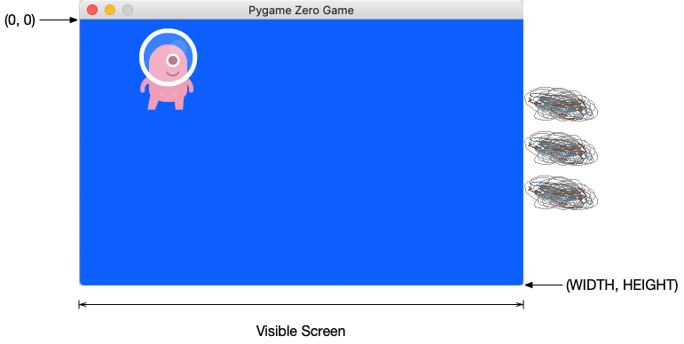
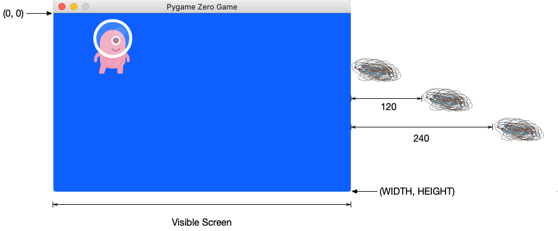

# Lesson 04

In Lesson 4, we made our game a little more challenging: the alien now has multiple asteroids to dodge. Before we could start implementing multiple asteroids, we first had to learn one more basic python concept: lists.

Here's everything we learned to do:
* Use Python lists: create them, append items to them, do things with the items in them.
* Refactor the code to make it easier to create multiple asteroids.
* Make multiple asteroids appear
* Refine when and where the asteroids appear to make the game more playable
* Use the `random` Python module to generate random numbers

Some notes on these topics follow.

# Python Lists
In this section, we'll step away from our game code for a moment to learn a new concept. Way back in Lesson 1, we learned that we can create variables to hold values. The variables we've used so far have each held a single value. But sometimes we have a need to store more than one thing in a variable. Python gives you a few different ways to do this; we're going to learn about one of the most versatile here: **lists**.

Let's say we wanted to store the names of the cousins in a variable. We could do so like this:

```
cousins = ["Sammy", "Khiyal", "Johar"]
```

Here we're creating a variable called `cousins` and assigning to it a list containing the names of the cousins. In Python, an open square bracket, `[`, indicates the beginning of the list. What follows is the items to put in the list, each separated from the next by a comma. Here, our list items are the strings `"Sammy"`, `"Khiyal"`, and `"Johar"`. We indicate the end of the list with the closing square bracket, `]`.

Note: Technically, our variable still contains a single value - the list itself - but the list carries other values within it, in a way that allows us to work with them easily.

Now, let's say we want to do something we each item in the list; print it, for example. To do that, we can use a loop. Loops are just things that let you execute a section of code repeatedly. In Lesson 1, we learned about one kind of loop: a while loop. Now we'll introduce another kind of loop: a **for loop**.

A for loop let's you do something once *for* each item in a list. Let's look at some code:

```
for cousin in cousins:
    print(cousin)
```

The keyword `for` in the first line begins the for loop. Next, is what's called an **iteration variable**: `cousin`. `cousin` is a variable that will take on each of the values in the list in turn. The keyword `in` precedes the list that we want to loop over, `cousins`.

The line ends in a colon, indicating that an associated block of code comes next, indented one level. The for loop will execute the indented block of code once for each item in the list. Each time it executes, the iteration variable (`cousin`) in our case, will hold the value of one of the items in the list.

The loop we have above does the equivalent of this code:

```
cousin = "Sammy"
print(cousin)

cousin = "Khiyal"
print(cousin)

cousin = "Johar"
print(cousin)
```

For each item in the list, the for loop assigns the list item to `cousin` and then executes the indented block of code beneath it. In our case, the indented block just prints the value of `cousin`.

Note: Here I used `cousin` for the iteration variable and `cousins` (plural) for the list. But there is no rule requiring the name of the iteration variable to be related to the name of the list. We could have said `for banana in cousins:`. But in most cases, you'll want to pick names that will make sense to someone reading your code.

In our code above, we give the list some values when we first create it. What if we want to add values to the list after that? Thankfully, there's an easy way to do that by using the `append()` function on the list itself. Let's add two more cousins to the list before we print the things in it:

<pre>
cousins = ["Sammy", "Khiyal", "Johar"]
<b>cousins.append("Swasya")
cousins.append("Keshav")</b>
for cousin in cousins:
    print(cousin)
</pre>

The new lines (shown in bold) call `append()` on the list object, passing a new value to add to the list in each call. After these lines, when we go over the list with a for loop and print each item, we'll see `"Swasya"` and `"Keshav"` included.

In the next section, we'll use a list in our game code to create multiple asteroids. Before we get there, one last thing to know about lists is that they can contain any type of value. Here all the values in the list were strings. But we can easily create a list of numbers:

```
ages = [10, 10, 12, 8, 10]
```

We can even create a list where some items are numbers and some are strings:

```
things = ["car", 28, "house", 187, 22]
```

In the game code we'll write in the next section, you'll see that lists can also contain objects, like the `Actor`s in our game.

# Refactoring

In this section, we're going to make a few changes to the structure of the game code to make it easier to introduce multiple asteroids. These changes won't actually change the behavior or appearance of the game: they are purely to re-organize the code to make it easier to implement the changes we want. This process is called **refactoring** and happens quite often in real software projects.

Before we begin, it's important to make sure we're starting from the right place. Your came code should look like this:

```
WIDTH = 500
HEIGHT = 300

alien = Actor("alien")
alien.pos = 100, 56

asteroid = Actor("asteroid")
asteroid.left = WIDTH
asteroid.top = 50

def draw():
    screen.fill((0, 102, 255))
    alien.draw()
    asteroid.draw()

def update():
    asteroid.left -= 2
    if alien.colliderect(asteroid):
        alien.image = "alien_hurt"
        # sounds.eep.play()
        clock.schedule_unique(set_alien_normal, 1.0)

def set_alien_normal():
    alien.image = "alien"

def on_key_down(key):
    if key == keys.DOWN:
        alien.top += 10
    elif key == keys.UP:
        alien.top -= 10
    if alien.top < 0:
        alien.top = 0;
    if alien.bottom > HEIGHT:
        alien.bottom = HEIGHT
```

If you've been experimenting and have changed your game code so that it doesn't look like this, that's okay! Just create a new file for this lesson, and the copy/paste the code above into it. This code is everything we did in Lesson 3, plus the answer to the first exercise from that Chapter. Run it to make sure it works before proceeding.

The first thing we'll refactor is the code that creates an asteroid:

```
asteroid = Actor("asteroid")
asteroid.left = WIDTH
asteroid.top = 50
```

We'll need to create asteroids multiple times, so it would be useful to have this code put into a function that we can easily reuse. Begin by replacing the lines shown above with the lines shown in bold below:

<pre>
WIDTH = 500
HEIGHT = 300

alien = Actor("alien")
alien.pos = 100, 56

<b>def makeAsteroid():
    asteroid = Actor("asteroid")
    asteroid.left = WIDTH
    asteroid.top = 50
    return asteroid

asteroid = makeAsteroid()</b>

def draw():
    screen.fill((0, 102, 255))
    alien.draw()
    asteroid.draw()
...
</pre>

We've used the keyword `def` to define a new function, `makeAsteroid()`. Inside this function, we have the exact same lines of code we used to create the asteroid before. The one new line is the `return asteroid`. This line returns the asteroid object we create inside the function to the caller of the function.

The next line, `asteroid = makeAsteroid()` shows how to use our new function. Here, we're assigning to the variable asteroid the result of calling our `makeAsteroid()` function. Because the function returns the newly created asteroid object, the variable `asteroid` ends up with this object in it.

If you run the game now, you should see it behave exactly as before - no changes whatsoever. This is actually a good thing. Remember, we're just re-organizing the code to make it easier to achieve the goal of multiple asteroids, but not actually changing what the code does.

OK, so we now have a function that creates asteroids. But notice that the position of the asteroid it creates is always the same: it sets the asteroid's `left` coordinate to `WIDTH` and `top` to 50. When we create multiple asteroids, we'll want to position them in different places. Let's make our function a little more flexible, to accommodate this.

Instead of having the function set `left` and `top` on the new asteroid to fixed values, let's pass in the values we want the function to use. Change your `makeAsteroid()` function as follows:

<pre>
def makeAsteroid(<b>left, top</b>):
    asteroid = Actor("asteroid")
    asteroid.left = <b>left</b>
    asteroid.top = <b>top</b>
    return asteroid
</pre>

We've changed the function definition to take two parameters, `left` and `top`. Inside the function, we set `asteroid.left` and `asteroid.top` to the values of these parameters. Remember that inside a function, the parameters are just like variables we can use. The values of those variables will be set according to what arguments the caller of the function passes. Because we've changed our function to accept these parameters, we have to also change the line that calls the function accordingly:

```
asteroid = makeAsteroid(WIDTH, 50)
```

Now, we're pass the left coordinate we want (`WIDTH`) and the top coordinate we want (`50`) as arguments to `makeAsteroid()`. Again, if you run the program, you shouldn't see any changes, but things are now set up well to implement multiple asteroids because we have a function that can create asteroids at any position.

# Multiple Asteroids
After all that refactoring work, we're finally ready to create multiple asteroids. Before we get into the code, you should understand conceptually the change we're about to make.

Right now, our program creates a single asteroid which we put into the variable `asteroid`. Then, in `draw()` we draw this asteroid and in `update` we change the position of the asteroid and check whether it's collided with the alien.

We're going to change the program to create, instead of a single asteroid, a list of asteroids. Then, in `draw()` we're going to use a for loop to go through the list and draw each asteroid. Similarly, in `update()`, we're going to go through the list with a for loop, updating each asteroid and checking for a collision with the alien.

Let's begin with creating the list of asteroids. Replace the line `asteroid = makeAsteroid(WIDTH, 50)` with:

<pre>
def makeAsteroid(<b>left, top</b>):
    asteroid = Actor("asteroid")
    asteroid.left = <b>left</b>
    asteroid.top = <b>top</b>
    return asteroid

<del>asteroid = makeAsteroid(WIDTH, 50)</del>
<b>asteroids = [makeAsteroid(WIDTH, 50), makeAsteroid(WIDTH, 100), makeAsteroid(WIDTH, 150)]</b>
</pre>

We are creating a list and assigning it to the variable `asteroids` (plural). We begin the list with the open square bracket (`[`). Each element of the list is an asteroid object, which we get by calling `makeAsteroid()`. This is why we did all that refactoring int he last section: to get a function we can use to make several asteroids easily. We close the list with `]`.

Now let's change `draw()` and `update()` to work with this list, instead of a single asteroid. Let's begin with `draw()`, the simpler of the two. Currently, `draw()` looks like this:

```
def draw():
    screen.fill((0, 102, 255))
    alien.draw()
    asteroid.draw()
```

That last line, `asteroid.draw()` is the one we have to change. We no longer have a single `asteroid` variable, but instead a list, in the variable `asteroids`. Change the code as follows:

<pre>
def draw():
    screen.fill((0, 102, 255))
    alien.draw()
    <del>asteroid.draw()</del>
    <b>for asteroid in asteroids:
        asteroid.draw()</b>
</pre>

Now we're using a for loop to go through the list, `asteroids`. Each time through the loop, the iteration variable, `asteroid` is assigned to be one of the asteroids in the list. In the body of the loop, we call `asteroid.draw()`, to draw the asteroid currently in the iteration variable. This results is each asteroid object having its `draw()` function called.

Next, we'll tackle `update()`. Though there's a little more code in `update()`, we're doing conceptually the same thing: replacing operations on the single `asteroid` object with a loop that does those operations on each asteroid in the list. `draw()` currently looks like this:

<pre>
def update():
    asteroid.left -= 2
    if alien.colliderect(asteroid):
        alien.image = "alien_hurt"
        # sounds.eep.play()
        clock.schedule_unique(set_alien_normal, 1.0)
</pre>

Change it to look like this:

<pre>
def update():
    for asteroid in asteroids:
        asteroid.left -= 2
        if alien.colliderect(asteroid):
            alien.image = "alien_hurt"
            # sounds.eep.play()
            clock.schedule_unique(set_alien_normal, 1.0)
</pre>

We've introduced a for loop that goes through the list, just like we had in `draw()`. The code within the for loop is actually the exact same code we had before. We just have to indent it, to put it in the body of the for loop. As before, each time through the loop, the variable `asteroid` becomes one of the asteroids in the list. The code in the body of the for loop moves this asteroid to the left and checks for collision with the alien. In this way, we end up doing these operations on each asteroid in the list.

Run your game now. You should see three asteroids emerging from the right-hand side of the screen towards your alien!

But in this form, it's not very interesting. The asteroids appear all at once, evenly spaced, and only make one pass across the screen. In the next section, we'll make some changes to the code to achieve more interesting asteroid behavior.

# Refining the Asteroids

In this section, we'll address some of the shortcomings of our current multiple asteroid implementation and make the game more interesting.

## One At a Time Asteroids

To start, let's make the asteroids enter the screen one at a time, rather than appearing all at once. There are different ways to do this but we'll take a simple approach: varying the asteroids' starting positions.

Right now, when we create each asteroid, we set its left position to `WIDTH`. This positions the asteroids just off-screen:

<p align="left">
  
</p>

When the game starts running, `update()` moves each asteroid left by 2 pixels every frame (60 times per second). Because the asteroids are positioned at the very edge of the visible screen, the very first `update()` brings their left sides into view and then each subsequent update moves them further to the left. The effect we see when we play the game is that the asteroids enter the scene immediately.

If we don't want the asteroids to be visible immediately, we can start them positioned further off screen. That way, they'd have to travel some distance before they enter the visible area of the screen. If we knew how fast they travel, we could control how long it takes for them to become visible by setting them an appropriate distance off screen.

In fact, we do know how fast they travel! Our `update()` function moves each asteroid two pixels to the left each time it runs (thanks to the `asteroid.left -= 2` line). And we know that `update()` runs 60 times per second. So, 2 pixels left, 60 times each second means that our asteroids travel 120 pixels every second. So to create a one second delay before we see an asteroid, we could position it 120 pixels off screen! Similary, 240 pixels offscreen would create a two-second delay.

Let's arrange things so that the first asteroid appears immediately, the second asteroid after one second, and the third after two seconds. To achieve this, we'll start the first asteroid immediately off-screen, the second, 120 pixels to the right, and the third, 240 pixels to the right:

<p align="left">
  
</p>

In code, this means we change the value we give for the `left` parameter to `makeAsteroid()` when setting up the list. Change the code that creates the list of asteroids to read:

<pre>
asteroids = [makeAsteroid(WIDTH, 50), makeAsteroid(WIDTH<b>+120</b>, 100), makeAsteroid(WIDTH<b>+240</b>, 150)]
</pre>

Run the code now and you should see the asteroids entering one after the other, one second apart!

## Making the Asteroids Return

In our update function, the line that causes the asteroids to move left is: `asteroid.left -= 2`; 60 times per section, this code runs and changes the asteroid's position 2 pixels to the left. After the asteroid moves so far left that it's off the screen, this code will just keep running, merrily moving the asteroid further left in off screen space. There's nothing that ever brings it back. When we play the game, we see the asteroids making one pass, moving left across the screen and then disappearing forever.

Let's make them return again after they exit the screen, to keep the action going. What we want to do is add some code to `update()` to check if the asteroid is off the screen and if so, reset it's position to somewhere from which it can enter again.

How can we check if the asteroid has moved so far left that's off the screen? Think about that and see if you can come up with any ideas.

There are actually a few different ways we can do this. If you came up with a different idea than what we're going to implement here, that's okay! We're going to do something rather simple: we'll check whether the asteroid's right side has moved off the left side of the screen. The x-coordinate of the asteroid's right side is available in `asteroid.right`. The left edge of the screen has an x-coordinate of 0. So we can simply check whether `asteroid.right < 0`. Modify your update function as follows:

<pre>
def update():
    for asteroid in asteroids:
        asteroid.left -= 2
        <b>if asteroid.right < 0:
            asteroid.left = WIDTH</b>
        if alien.colliderect(asteroid):
        ...
</pre>

We check if `asteroid.right` is less than zero if so, we set `asteroid.left` to `WIDTH`. This resets the position of the asteroid to just off the right-hand side edge of the screen. From there, it'll start moving left again on each `update()`. Run the code and see this in action. You should see the asteroids enter the screen one at a time, every one second, and after they disappear, they should re-enter the screen from the right.

Note: You may notice that even after the first pass, the asteroids continue to enter the screen one at a time, one per second. We didn't do anything special in our `update()` code to enable this: every time the asteroid leaves the screen, it left coordinate gets set to `WIDTH` positioning it just off the screen. Because of the changes we made in the previous section (starting the second asteroid 120 pixels further out and the third asteroid 240 pixels out), each asteroid gets to the left edge of the screen one second apart. And so they each get reset to the right-hand side, ready to re-enter, one second apart. This works out very nicely for us!

## Randomizing the Asteroid Heights
Now we've got three asteroids which enter one at a time and return after they leave the screen. But, they always return at the same height (the same y-coordinate). This makes the game not very interesting. You could easily come up with a pattern of moves that always avoids the asteroids.

To make the game more interesting, we should make the asteroids enter at random y-coordinates. Then, the player wouldn't know where the next asteroid will enter the screen.

In our current code, we set the asteroids' `top` coordinate when we create them:

<pre>
asteroids = [makeAsteroid(WIDTH, <b>50</b>), makeAsteroid(WIDTH+120, <b>100</b>), makeAsteroid(WIDTH+240, <b>150</b>)]
</pre>

The three asteroids' `top` values are set to 50, 100, and 150 respectively and never change. The asteroids thus always appear at these y-coordinates. We want to change this so that the asteroids' `top` value is set to a random number between 0 (the top of the screen) and `HEIGHT` (the bottom of the screen).

Python comes with a function we can use to generate a random number. But unlike built-in functions we've used before (like `print()` or `input()`), to use the random number functions, we need to **import the `random` module** into our code.

What does that mean? Python comes with a rich library of functions you can use for things like generating random numbers and lots more. These functions are organized into units called **modules** which help keep them organized. Modules group related functions together and keep them neatly separated from other code.

The module we're interested in is called [`random`](https://docs.python.org/3/library/random.html). The `random` module contains many functions related to generating random numbers but the one we're going to use is [`randint()`](https://docs.python.org/3/library/random.html#random.randint). The `int` in the name refers to "integer" (or whole number, as we learned about in Lesson 1); `randint()` is a function that returns a random integer. It takes two integers as arguments and returns a random integer in between the those. E.g. if you call `randint(0, 10)`, you'd get a random integer between 0 and 10.

Note: It's important to know that `randint()` includes the numbers that you give it in the range of possible random numbers it could return. So e.g. `randint(0, 10)` could return 0 or 10.

To use the `randint()` function from the `random` module, we must **import** it into our code. Scroll to the very top of your file and add this line as the very first line:

```
from random import randint
```

This tells Python to make `randint()` from `random` available to for us to use later in the code. Now let's actually use it! Change the code that creates the asteroids, replacing the hard-coded values we specified for the tops (50, 100, and 150), with calls to `randint()`:

<pre>
asteroids = [makeAsteroid(WIDTH, <b>randint(0, HEIGHT-1)</b>), makeAsteroid(WIDTH+120, <b>randint(0, HEIGHT-1)</b>), makeAsteroid(WIDTH+240, <b>randint(0, HEIGHT-1)</b>)]
</pre>

Now, when we create each asteroid, the value we pass for `top` is the return value from `randint()`. In each call to `randint()`, we're passing `0` for the lower limit and `HEIGHT-1` for the upper limit. We want `randint()` to return a y-coordinate in the visible area of our screen. We know that the very top of the screen is y-coordinate 0, so that makes sense as the lower limit. But why `HEIGHT-1` for the upper limit? The screen's height is equal to the variable `HEIGHT` (300 in our case), but remember that we start counting from 0, not 1, so the very last row of pixels on the screen has y-coordinate of 299 (`HEIGHT-1`), not 300.

Notice that the line of code that creates our list of asteroids is now getting a little long. We can reformat that over several lines as follows:

```
asteroids = [
    makeAsteroid(WIDTH, randint(0, HEIGHT-1)),
    makeAsteroid(WIDTH+120, randint(0, HEIGHT-1),
    makeAsteroid(WIDTH+240, randint(0, HEIGHT-1))
]
```

When you do this, be careful to get the indentation right! Notice that we haven't actually changed any of the code, just added some line breaks. This makes it easier for us to read, but doesn't change what it does.

Run the program now. You should see the asteroids come in at different, random heights on the screen. This makes the game more interesting than when they were always at fixed heights.

But you may notice a problem. Sometimes, the asteroids appear so low on the screen that you can barely see them at all. This may not happen every time - it depends on what random values you get from `randint()` - but if you run it a few times you should see the problem.

Why does this happen? Let's look again at our calls to `randint()`: we're specifying 0, the y-coordinate of the top of our screen, as the lower limit, and `HEIGHT-1`, the y-coordinate of the bottom of our screen, as the upper limit. But remember, we're using the value we get back from `randint()` as the *top* coordinate of the asteroid.

0 makes sense as the lower limit for the top of the asteroid: the top shouldn't be higher than the top of the screen. But `HEIGHT-1` for the upper limit is causing us problems. We're allowing the *top* of the asteroid to appear as low as the very last row of pixels on the screen. That's not right. What we want to do is ensure that the *bottom* of the asteroid is as low as (and no lower than) the bottom of the screen.

The asteroid image I'm using is 100 pixels by 100 pixels. So I can fix this problem by changing the upper limit in my `randint()` calls to `HEIGHT-100`:

<pre>
asteroids = [
    makeAsteroid(WIDTH, randint(0, HEIGHT-<b>100</b>)),
    makeAsteroid(WIDTH+120, randint(0, HEIGHT-<b>100</b>),
    makeAsteroid(WIDTH+240, randint(0, HEIGHT-<b>100</b>))
]
</pre>


This ensures that the top of the asteroid will always at least 100 pixels from the bottom of the screen so I know they whole asteroid will always appear. If your asteroid image is a different height, replace `100` with the appropriate value above. Now when you run the program, you should see that the asteroids always appear fully onscreen!

But there's one last thing we could improve: The asteroid heights are chosen randomly when we create them but then they stay at those heights for the rest of the game. It would be better if, after the asteroids disappear off the left side of the screen, they re-enter from the right at a random height.

We can make this change by adding one line of code. When we reset the asteroid's position to just off the right-hand side edge of the screen after they disappear off to the left, we can also adjust the asteroid's height to a random value, again using `randint()`. Add the line of code shown in bold below in your `update()` function:

<pre>
def update():
    for asteroid in asteroids:
        asteroid.left -= 2
        if asteroid.right < 0:
            asteroid.left = WIDTH
            <b>asteroid.top = randint(0, HEIGHT-100)</b>
        if alien.colliderect(asteroid):
            alien.image = "alien_hurt"
            # sounds.eep.play()
            clock.schedule_unique(set_alien_normal, 1.0)

</pre>

Now you should see the asteroids return at different, random heights each time they re-enter the screen.


