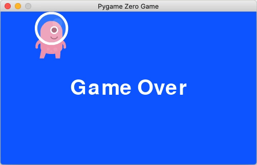

# Lesson 05

In Lesson 5, we made changes to the keyboard controls to make it easier to move the alien around. We also added the concept of lives to the game: now, after the alien is hit three times, it's Game Over!

Here's everything we learned to do:
* Use global variables
* Respond to both key down and key up events, to enable movement when the player holds down a key.
* Keep track of the number of lives the alien has, which was trickier than we expected!

# Improving Keyboard Controls
In Lesson 3, we implemented the code that let the player move the alien up and down with the arrow keys. Our code detected when the up or down key was pressed, and then moved the alien up or down by 10 pixels each time. That code looks like this:

```
def on_key_down(key):
    if key == keys.DOWN:
        alien.top += 10
    elif key == keys.UP:
        alien.top -= 10
    ...
```

When playing, you may have tried holding the arrow keys down, hoping the alien would keep moving as long as you kept the key pressed down. But sadly, this doesn't work. That's because the code we wrote responded to the arrow keys being pressed *down* and each downward press of the key resulted in one 10-pixel movement. If you held the key down, you made just one downward press, so our code made one 10-pixel movement.

What we implemented works, but doesn't feel great when we play the game. We end up having to mash the arrow keys multiple to times to get the alien to move fast and the movement looks and feels a little jumpy. Let's see if we can do better.

To begin, let's first describe the behavior we want: We'd like the player to be able to press and hold the up key or down key, and have the alien keep moving smoothly in the appropriate direction, as long as the key is pressed.


## A New Mental Model

To implement this, we have to change how we think about the alien's movement. The way we have it currently implemented, we only move the alien (by changing `alien.top`) when a key is pressed down. What actually happens is something like this sequence of events:


* `update()` changes the asteroids' positions by setting `asteroid.top` and `asteroid.left`
* `draw()` draws the alien and asteroids at their current positions
* `update()` changes the asteroids' positions by setting `asteroid.top` and `asteroid.left`
* `draw()` draws the alien and asteroids at their current positions

... and so on, 60 times per second ... then an up- or down-arrow key press happens:

* **`on_key_down()` changes the alien's position by setting `alien.top`**
* `update()` changes the asteroids' positions by setting `asteroid.top` and `asteroid.left`
* `draw()` draws the alien and asteroids at their current positions

... and so on, 60 times per second

Instead, what if we moved the alien, by changing `alien.top`, on *every frame* (every time `update()` is called, which happens 60 times per second)? This would result in the alien moving smoothly, like the asteroids do.

But, the asteroids just move autonomously, all the time, and we want the alien's movement to be in the player's control. Specifically, we want the alien's amount and direction of movement to depend on the keys pressed. So we can't just adjust the alien's position by a set number of pixels in each `update()` call, like we do for the asteroids.

Let's break down what we want to happen in the different cases:
* If no key is pressed, we don't want the alien to move; `update()` should not change `alien.top`.
* If the down arrow key is pressed, we want the alien to move down; `update()` should *add* to `alien.top` - make the value bigger - because bigger values are further down along the y-axis.
* If the up arrow key is pressed, we want the alien to move down; `update()` should *subtract* from `alien.top` - make the value smaller - because smaller values are further up along the y-axis.

<p align="center">
  
</p>

These statements express what should happen in the way humans normally talk to each other. But we can also express express them in a more Computer Science-like way, that makes it easier to translate them into code:

| Case | Human Way | Computer Science Way |
|------|-----------|----------------------|
| If no key is pressed, `update()` should | not change `alien.top` | add `0` to `alien.top` |
| If down key is pressed, `update()` should | add to `alien.top` | add a positive number to `alien.top` |
| If no key is pressed, `update()` should | subtract from `alien.top` | add a negative number to `alien.top` |

Go through the lines in this table one by one, and make sure you understand why the "Human Way" and "Computer Science Way" descriptions are really saying the same thing.

Looking at the "Computer Science Way" column, we see that in every case, we just add something to `alien.top`. The only difference between the cases is what value we add (0, a positive number, or a negative number). In code, this means:

* We can create a variable to hold the value we want added to `alien.top`.
* The code that detects key presses can change the value of this variable.
* `update()` can just add the value in this variable to `alien.top` in each frame.


## Implementing the New Model

OK, that was a lot of explaining! Let's get back into some code!

To begin, let's make sure we're starting from the right place. Your game code should look like this:

```python
from random import randint

WIDTH = 500
HEIGHT = 300

alien = Actor("alien")
alien.pos = 100, 56

def makeAsteroid(left, top):
    asteroid = Actor("asteroid")
    asteroid.left = left
    asteroid.top = top
    return asteroid

asteroids = [
    makeAsteroid(WIDTH, randint(0, HEIGHT-100)),
    makeAsteroid(WIDTH+120, randint(0, HEIGHT-100)),
    makeAsteroid(WIDTH+240, randint(0, HEIGHT-100))
]

def draw():
    screen.fill((0, 102, 255))
    alien.draw()
    for asteroid in asteroids:
        asteroid.draw()

def update():
    for asteroid in asteroids:
        asteroid.left -= 2
        if asteroid.right < 0:
            asteroid.left = WIDTH
            asteroid.top = randint(0, HEIGHT-100)
        if alien.colliderect(asteroid):
            alien.image = "alien_hurt"
            # sounds.eep.play()
            clock.schedule_unique(set_alien_normal, 1.0)

def set_alien_normal():
    alien.image = "alien"

def on_key_down(key):
    if key == keys.DOWN:
        alien.top += 10
    elif key == keys.UP:
        alien.top -= 10
    if alien.top < 0:
        alien.top = 0;
    if alien.bottom > HEIGHT:
        alien.bottom = HEIGHT
```

This code is the end state from the previous lesson. If your code doesn't look like this, just create a new file for this lesson, and copy the code above into it and you'll be ready to go.

### New Alien Movement Code

First, let's create the variable we're going to use to store the value that we'll add to `alien.top` in each frame. We're going to call this variable `alien_y_speed` because it represents the speed the alien moves in the y direction. Create this variable and set it to 0, near the top of the program, just after you create the alien. The snippet below shows where the new line (bolded) should appear:

<pre>
...
WIDTH = 500
HEIGHT = 300

alien = Actor("alien")
alien.pos = 100, 56

<b>alien_y_speed = 0</b>

def makeAsteroid(left, top):
...
</pre>

Next, let's change `update()` to adjust `alien.top` using this variable:

<pre>
def update():
    <b>alien.top += alien_y_speed</b>

    for asteroid in asteroids:
    ...
</pre>

We're using `+=` to say "take what's in `alien.top` and add what's in `alien_y_speed`". If we just add to `alien.top`, we might actually move the alien off the top or bottom of the screen (because `alien.top` might end up being less than 0 or bigger than `HEIGHT`).

We had this problem when we first introduced keyboard movement in Lesson 3, and fixed it in an exercise. The code that fixes it is currently in our `on_key_down` handler:

<pre>
def on_key_down(key):
    if key == keys.DOWN:
        alien.top += 10
    elif key == keys.UP:
        alien.top -= 10
    <b>if alien.top < 0:
        alien.top = 0;
    if alien.bottom > HEIGHT:
        alien.bottom = HEIGHT</b>
</pre>

It checks whether `alien.top` has become less than `0` (and adjusts it to `0`, if so) or greater than `HEIGHT` (and adjusts it to `HEIGHT` if so). Since we are now performing adjustments to `alien.top` in `update()`, we need to move this code (shown in bold above) there. Remove it from `on_key_down()` and add it to `update()` just after the line we just added to change `alien.top`:

<pre>
def update():
    alien.top += alien_y_speed
    <b>if alien.top < 0:
        alien.top = 0;
    if alien.bottom > HEIGHT:
        alien.bottom = HEIGHT</b>

    for asteroid in asteroids:

...

def on_key_down(key):
    if key == keys.DOWN:
        alien.top += 10
    elif key == keys.UP:
        alien.top -= 10
</pre>

Note: `on_key_down()` currently still changes `alien.top` so you might be worried about removing this code from there, but we're about to change `on_key_down()` to not change `alien.top` shortly.


OK, so now we have our variable that controls how much we adjust `alien.top` in each frame, and the code in `update()` that performs the adjustment, along with the check to make sure the alien doesn't move out of the frame. Next, we need to write the code to adjust the value stored in `alien_y_speed` depending on key presses.

### Handling Key Down Events
We'll start with the downward key presses, which we handle in `on_key_down()`. Change `on_key_down` to read as follows:

```python
def on_key_down(key):
    global alien_y_speed
    if key == keys.DOWN:
        alien_y_speed = 2
    elif key == keys.UP:
        alien_y_speed = -2
```

Ignore the `global alien_y_speed` for a moment - I'll come back to it shortly.

Remember that `on_key_down()` is called whenever a key is pressed *down*. The parameter, `key`, gets a value that indicates which key was pressed down. We can compare this value against variables in the `keys` object to determine which key was pressed. Now, when the down key is pressed, we set `alien_y_speed` to `2` and when the up key is pressed, we set `alien_y_speed` to `-2`. Combined with the code we just wrote above, this will cause `update()` to add `2` or `-2` to `alien.top` each frame, moving the alien down or up, depending on which key was pressed.

Now, back to that `global alien_y_speed` line; to understand this, you need to understand a new concept:

### Global and Local Variables
`alien_y_speed` is what's known as a **global variable**. We created it outside of any function, so it belongs to the whole program. To understand global variables, it helps to first understand the opposite.

When you create a variable inside a function, that variable only exists for the code inside the function. We call such a variable a **local variable**. If you tried to access a local variable outside the function that created it, you'd get an error. Here's a silly example that illustrates this (don't add this to your game code - I'm just using it here to explain the concept of global and local variables):

```python
def myFunction():
    name = "Sammy"
    print("Inside myFunction, name is: " + name) # This works

myFunction()
print("Outside myFunction, name is: " + name) # NameError: name 'name' is not defined
```

In `myFunction()` we create a variable, `name`, give it a value and then print its value. This works. But if we try to print the variable's value outside `myFunction()`, we get an error: Python doesn't know about a variable called `name` outside `myFunction()`, because it's *local* to `myFunction()`.

This might seem a little surprising or strange, but it's actually a really good thing that variables created inside functions are local, by default. It makes a lot of things simpler: you don't have to worry that another function might have already created a variable with the same name, or that some code outside your function might change what's in your variables in a way you don't expect. It also means that each time your function runs, the local variables are created again, fresh. So you don't have to think about what happens to the values in those variables across function calls.

Global variables, on the other hand, can be accessed in many different functions and even in code that isn't in any function. Global variables keep whatever value they hold across function calls. So if one function puts a value into a global variable, when another function reads from the variable, it will see that value.

Earlier, we said that `alien_y_speed` is a global variable. Why does it have to be global? Because it contains information that we need in different functions: we set it in `on_key_down()` and we read its value in `update()`. Not only does it have to be accessible across functions but it needs to keep its value across different functions. That's exactly what a global variable does!

In our `on_key_down()` function, look at the line `alien_y_speed = 2`. That line could mean two different things: "create a local variable called `alien_y_speed` and assign it the value `2`" or "put `2` in the global variable `alien_y_speed`". How would the Python interpreter know which one we mean? The answer is the line `global alien_y_speed` at the top of the function. That line tells the Python interpreter that we'll be referencing a global variable called `alien_y_speed` inside this function.

Notice that in `update()`, we didn't need the `global` keyword to access `alien_y_speed`. That's because we're only reading a value from the variable, not putting a new value into it. In Python, any variable that you read from in a function is assumed to be global, unless you created it inside the function. In contrast, any variable you create inside a function is assumed to be local, unless you use the `global` keyword to mark it as global. The rationale for this is explained in [the Python documentation](https://docs.python.org/3/faq/programming.html#what-are-the-rules-for-local-and-global-variables-in-python).

Here's a silly example that shows the behavior of global variables (again, don't put this in your game code but just read and think about what it does):

```python
name = "Sammy" # name is created outside of any function, so it's global
print(name) # code outside of a function can use name

def greet():
    print("Hello " + name) # Can access name inside this function

def changeName():
    global name # Tell Python that name refers to a global variable
    name = "Khiyal" # Set name to a new value

greet() # Prints "Hello Sammy"
changeName() # Puts "Khiyal" into name
greet() # Now prints "Hello Khiyal"
```

### Handling Key Up Events
So far, we've made the changes to move the alien based on the value in the global variable `alien_y_speed` and we set `alien_y_speed` to the values needed to move the alien up or down, when the up or down arrow key is pressed down. But if you run the game now, you'll notice that once the alien starts moving, it never stops, even if you release the key. Take a moment and think about why that's happening.

The answer is that we don't have any code that sets `alien_y_speed` back to zero when the key is released. Let's add that now. When a key is pressed down, `on_key_down()` is called. As you might guess, `on_key_up()` is called when a key is released. `on_key_up()`, just like `on_key_down`, takes a `key` parameter which you can use to tell which key was released.

Add this `on_key_up()` function to your code:

```python
def on_key_up(key):
    global alien_y_speed
    if key == keys.DOWN:
        alien_y_speed = 0
    elif key == keys.UP:
        alien_y_speed = 0
```

This implementation should be fairly straightforward to understand. First, we tell Python that we'll be referencing the global variable `alien_y_speed`. Then, if the key released is either the up or down arrow, we set alien_y_speed to zero.

Now, when you run the code, you should be able to move the alien up or down continuously by holding down the appropriate key. When you release the key, the alien stops moving.

# Tracking Lives
In this section, we'll introduce the concept of lives. We'll make it so that the alien starts with three lives, and loses one each time it's hit by an asteroid. When the alien loses all three lives, the game is over and we'll show a Game Over screen.

To track lives, we'll need another global variable. This variable (we'll call it `lives`) will contain the number of lives the alien currently has. Why does it need to be global? Because we need to access it in different functions and because we want it to keep it's value across functions.

To start, let's simply declare the global variable at the top, right below where you declared `alien_y_speed`:

<pre>
...
WIDTH = 500
HEIGHT = 300

alien = Actor("alien")
alien.pos = 100, 56

alien_y_speed = 0
<b>lives = 3</b>

def makeAsteroid(left, top):
...
</pre>

Next, let's decrease by one life whenever the alien is hit by the asteroid function. Go to `update()` and add the lines shown in bold below.

<pre>
def update():
    <b>global lives</b>
    alien.top += alien_y_speed
    if alien.top < 0:
        alien.top = 0;
    if alien.bottom > HEIGHT:
        alien.bottom = HEIGHT

    for asteroid in asteroids:
        asteroid.left -= 2
        if asteroid.right < 0:
            asteroid.left = WIDTH
            asteroid.top = randint(0, HEIGHT-100)
        if alien.colliderect(asteroid):
            alien.image = "alien_hurt"
            <b>lives -= 1</b>
            # sounds.eep.play()
            clock.schedule_unique(set_alien_normal, 1.0)
</pre>

We've added a `global` statement to let Python know we'll be changing the global variable, `lives` and inside the if-statement that detects collisions, we've added a line that decreases the value in `lives` by one. Pretty simple so far!

Now, let's draw a Game Over message if `lives` goes to zero. We do all drawing operations in our `draw()` function, so let's add some code there:

<pre>
def draw():
    screen.fill((0, 102, 255))
    alien.draw()

    <b>if lives <= 0:
        screen.draw.text("Game Over", center=(250, 150), fontsize=60)
        return</b>

    for asteroid in asteroids:
        asteroid.draw()
</pre>

As usual, the new code is shown in bold. We've added an if-statement that checks if `lives <= 0`. Why did we check for lives being less than or equal (`<=`) rather than equal (`==`) to zero? If things are positioned just right, it's possible that the alien might collide with more than one asteroid. In `update()` say `lives` had the value `1` coming in, and then two collisions occurred. The first would take `lives` down to zero, and the second would take it down to -1. If we had checked for lives being exactly equal to zero, we'd never see the Game Over message in this case. It's a rare case, but as programmers, we have to think about such things!

The next line draws the "Game Over" text. Pygame Zero's built-in `screen` object has a sub-object, `draw` that offers several useful drawing functions. The one we're using here, `text()` draws text, as the name suggests. The first argument (parameter value) is the text that we want it to draw; here, simply the words "Game Over".

The rest of the arguments might look a big strange to you. Rather than just a list of values like we're used to seeing, these arguments (`center=(250, 150)` and  `fontsize=60`) look a bit like the way we create variables. In fact, these are called **keyword arguments**.

We pass keyword arguments by specifying their name, followed by an equals sign, then the value we want to pass for that argument. Here, we'd like `center` to have the value `(250, 150)`, and `fontsize` to have the value `60`. Keyword arguments always go a the end of an argument list, after any regular arguments.  They are useful in cases where a function may take many arguments, but not all of them are required. `screen.draw.text()` accepts a long list of arguments that control various aspects of the way text is drawn (e.g. color and transparency, amongst many more). By making these keyword arguments, the author of Pygame Zero allows us to pick and choose which ones we want to specify, and in what order. We've just chosen to specify where the center of the text should go (the coordinates, 250, 150) via `center` and the font size, via `fontsize`. You can read more about all the text arguments in the [`screen.draw.text()` documentation](https://pygame-zero.readthedocs.io/en/stable/ptext.html).

The last of the new lines we added is `return`. We saw the `return` keyword in Lesson 2, when we first learned about functions that can return values. `return` always exits a function and *returns* to whatever code called the function. If `return` is followed by a value (like in the examples in Lesson 2) then that value is returned to the caller. If there's no value after `return`, like in our usage here, it just causes the function to return without returning a value.

We've used `return` here because we'd like to skip the rest of the `draw()` function if we're in the Game Over state. There's no need to draw the asteroids if the game is over. We could also have accomplished this by moving the code that draws the asteroids into an `else` block of the `if lives <= 0` if-statement, but adding the return is a little simpler.

You can run the game now to see the lives concept and Game Over screen in action. But when you do, you might be surprised. Even though we coded the logic for three lives, it seems like we get to Game Over as soon as the alien is hit by an asteroid for the first time.

This is actually a pretty interesting bug! It's an example of an important concept we learned about way back in Lesson 1: the computer will do exactly what we tell it to do, which is not necessarily what we want it to do. We wanted the alien to have 3 lives and we wrote code that we thought implemented that. But it seems like actually the alien is only getting one life.

Take a little time to see if you can figure out what's going on. We'll debug together in the next section.

## Debugging
Sometimes, you run into problems you just can't figure out by reading the code. When this happens, there are techniques you can use to give yourself more clues. One such technique is to insert `print()` statements into your code to give yourself helpful information about what's happening.

We know that `lives` starts out as 3 and that when it gets to 0, we show the Game Over message. And Game Over seems to show too quickly, so a good place to start looking is in the code that decreases `lives` when a collision occurs. Let's add some code to give us some visibility into what's happening:

<pre>
def update():
    global lives

    ...
    for asteroid in asteroids:

        ...
        if alien.colliderect(asteroid):
            alien.image = "alien_hurt"
            lives -= 1
            <b>print("Decreased lives to: " + str(lives))</b>
            # sounds.eep.play()
            clock.schedule_unique(set_alien_normal, 1.0)
</pre>

Beneath the line that decrements `lives`, we've added a print statement that tells us we've decreased lives and prints the current value of `lives` (using `str()` to convert the integer to a string for printing).

Run the game now and move the alien into the path of an asteroid, and watch the console at the bottom of the Mu editor. You should see that as soon as the asteroid hits the alien, the output of our `print()` statement starts spewing output. You should see lives decreasing 3 to 2 to 1 to 0, and then to keep on decreasing to very large magnitude negative numbers.

Note: Depending on what color theme you're using in Mu, the minus sign in the negative numbers might be hard to see, but it is there!

What's going on? If you can't figure it out at first, keep running it over and over, looking for patterns. One thing that's a bit frustrating is that the Game Over screen shows up right away and that makes it hard to observe the alien and asteroid interactions. Let's temporarily disable the Game Over screen in the `draw()` function. The easiest way to do that is to change the if statement as follows:

<pre>
def draw():
    ...

    if <b>False and </b>lives <= 0:
        screen.draw.text("Game Over", center=(250, 150), fontsize=60)
        return

    for asteroid in asteroids:
        asteroid.draw()
</pre>

We've changed the condition in the if statement to `False and ` whatever we had before. `False` is a special Python value that always evaluates to false, as the name suggests. By putting `False and ` at the start of the condition, we force the condition to always be false, making it so we never go into the if-statement's block that draws the Game Over screen.

Now we can do more observation. Look closely at what's going on on the screen and and what's getting printed in the Mu console. I notice that as soon as an asteroid collides with the alien, lots of "Decreased lives to: ..." lines start getting printed. But then, as soon as the asteroid passes over the alien, the "Decreased lives..." lines stop for a while. This lasts until the next asteroid collision, and then they go again until that asteroid has passed away.

<p align="center">
  
</p>


This is a big clue! It seems that we decrease a life over and over, for the entire duration that an asteroid and the alien are touching. When we look back at our code again with this perspective, we might see better what's wrong.

In our `update()` function, we're checking for a collision with the asteroid and decreasing a life (bold below indicates the code of interest, not new code):

<pre>
def update():
    global lives

    ...
    for asteroid in asteroids:

        ...
        <b>if alien.colliderect(asteroid):
            alien.image = "alien_hurt"
            lives -= 1
            print("Decreased lives to: " + str(lives))</b>
            # sounds.eep.play()
            clock.schedule_unique(set_alien_normal, 1.0)
</pre>

But wait! This code runs 60 times every second. Every time it runs, `if alien.colliderect(asteroid)` will be true if the asteroid and the alien are touching. And the asteroid takes a little while, maybe more than a second, to pass over the alien. If it takes just over a second, that means this code will run just over 60 times for a single occurrence of what we, from the player's perspective, think of as a single collision. And we'll be decreasing `lives` by one in every one of those 60+ runs. That explains why, on the very first collision, we go straight to Game Over.

OK, we've made progress. But how do we fix it? We want a life to be taken away the first time the asteroid collides with the alien. For the rest of the time that same asteroid is passing over the alien, we don't want to decrease any more lives.

There are many ways that we can make that happen. One approach is to decrease a life the collision happens and then temporarily make the alien "invincible" until the asteroid passes over it, so that subsequent collision checks don't result in decreasing `lives`. Let's implement that!

We need one more global variable, that stores whether or not the alien can be hurt. This variable stores either the value `True` or `False` (incidentally, variables that are always either true or false are called **Boolean variables**). At the top of the program, add the line shown in bold below:

<pre>
...
WIDTH = 500
HEIGHT = 300

alien = Actor("alien")
alien.pos = 100, 56

alien_y_speed = 0
lives = 3
<b>alien_can_hurt = True</b>
...
</pre>

The variable starts out with the value `True` because at the start of the game, the alien can be hurt. We now need three changes inside `update()`

<pre>
def update():
    global lives
    <b>global alien_can_hurt</b>

    ...
    for asteroid in asteroids:

        ...
        if alien.colliderect(asteroid)<b> and alien_can_hurt</b>:
            alien.image = "alien_hurt"
            lives -= 1
            print("Decreased lives to: " + str(lives))
            <b>alien_can_hurt = False</b>
            # sounds.eep.play()
            clock.schedule_unique(set_alien_normal, 1.0)
</pre>

First, we add a `global` statement, so Python knows we'll be referencing the `alien_can_hurt` global variable inside `update()`.

Next, we've changed the if-statement condition by adding `and alien_can_hurt`. So now we check if there is a collision **and** whether `alien_can_hurt` is `True`. `and` works as you think it should: both things on either side of it have to be true for the whole condition to be true. With this change, when a collision occurs, we only go into the if-statement block, which decreases `lives`, if `alien_can_hurt` is `True`.

Finally, inside the if-statement's block, after we decrease a life, we set `alien_can_hurt` to `False`. After this happens any subsequent run of `update()` will not go into this block of code, even if a collision occurs.

But at some point we have to set `alien_can_hurt` back, or else the alien will be invincible forever afterwards. A good place to do that is in our existing `set_alien_normal()` function, where we set the alien's image back to normal, a second after the first collision. The line `clock.schedule_unique(set_alien_normal, 1.0)` schedules the call to `set_alien_normal()` after one second and we leave this as is.

Inside `set_alien_normal()` we add two simple lines:

<pre>
def set_alien_normal():
    <b>global alien_can_hurt
    alien_can_hurt = True</b>
    alien.image = "alien"
</pre>

The first one, `global alien_can_hurt` tells Python we'll be accessing the `alien_can_hurt` global variable. The second sets that variable to true. After this runs, the alien can be hurt again.

In summary, the sequence is as follows:
* At the start of the game `alien_can_hurt` is `True`.
* The first time `update()` runs after a collision, `alien_can_hurt` is `True`, so we decrease a life and set `alien_can_hurt` to `False`.
* After that each call to `update()` does not enter the code that decreases a life until...
* A second later `set_alien_normal()` runs and sets `alien_can_hurt` back to `True`.

Before we run it again, remember to remove the change we made to `draw()` to prevent the Game Over screen from loading. We want to see that screen now!

<pre>
    if <del>False and </del>lives <= 0:
        screen.draw.text("Game Over", center=(250, 150), fontsize=60)
        return
</pre>

Run it now and see what happens! For me, it looks like things are much improved. We can play on after the first collision. But it does seem as though I'm only getting two lives instead of three.

Looking closely at my debug statements, I see that it seems like we may be decreasing two lives on the first asteroid collision, but the second life decrease doesn't happen right away. It seems to take... about a second. Interesting! It looks like it takes the asteroid more than a second to pass over the alien and we are setting `alien_can_hurt` back to `True` after just one second. So there may be a short period of time after we set `alien_can_hurt` back to `True` that the same asteroid that caused the life to be taken away is still colliding with the alien.

Note: In debugging, there are often many ways to figure out what's going wrong. One of the class participants noticed that the bug where two lives are taken away for the same asteroid doesn't happen when you move the alien away from the asteroid as soon as the initial hit happens. Doing so makes it so that when the one second expires, the alien is no longer colliding with the asteroid, so we don't remove another live. Trying lots of different things to understand the behavior of your program is one of the keys to debugging!

Let's change our so that we do that after two seconds and see if it helps. Change the line inside `update()` that schedules the call to `set_alien_normal()` as follows:

<pre>
            clock.schedule_unique(set_alien_normal, <del>1.0</del><b>2.0</b>)
</pre>

That seems to do the trick! Now we have our three lives working as we'd expect.

## One Last Bug!
If you leave the game on the game over screen for a while, you may notice something strange: the alien occasionally changes to the hurt state and then back again. This looks a little odd - we should fix it before we wrap up this lesson. Can you figure out why this is happening?

<p align="center">
  
</p>

Way up above, when we first introduced the concept of lives, we added the code to `draw()` to draw the Game Over screen if `lives <= 0`. And we made `draw()` return after drawing the game over screen, effectively skipping the code that draws that asteroids. That's why we don't see any asteroids on the game over screen.

But though we aren't *drawing* the asteroids, they still exist as `Actor` objects and our `update()` code is actually updating them. So even though we can't see the asteroids, our `update()` function is still moving them and reacting to collisions with the alien by changing the alien to the hurt state. Because we *are* drawing the alien on the Game Over screen (note that the `alien.draw()` line happens before the `return` in `draw()`) we see the effects of this: periodically, the alien gets hit by invisible asteroids, changes to the hurt state, and then changes back after 2 seconds.

The fix for this is really simple: we just need to skip most of the `update()` code when we're out of lives. We can do that by adding an if-statement that checks for `lives <= 0` and `return`s from `update()` if so:

<pre>
def update():
    global lives
    global alien_can_hurt

    alien.top += alien_y_speed
    if alien.top < 0:
        alien.top = 0;
    if alien.bottom > HEIGHT:
        alien.bottom = HEIGHT

    <b>if lives <= 0:
        return</b>

    for asteroid in asteroids:
    ...
</pre>

Now, when `lives <= 0`, we bail out of `update()` before doing any of the asteroid update logic. If you run the game now, you should no longer see the alien changing back and forth between the hurt and normal states on the Game Over screen.

Notice that because of where we placed the lives check and `return` statement, we are still doing updates to the alien position based on `alien_y_speed`, even when it's game over. This lets the alien keep moving in response to the arrow keys (try it: on the Game Over screen, you should still be able to move the alien up and down).

We don't have to implement it this way (we could have put the return from `update()` at the very top, preventing any alien movement), but because the alien is still visible, letting the player move it keeps things feeling interactive. Later, we'll implement a way to restart the game from the Game Over screen. But for now, allowing movement tells the player that the game isn't totally frozen.
