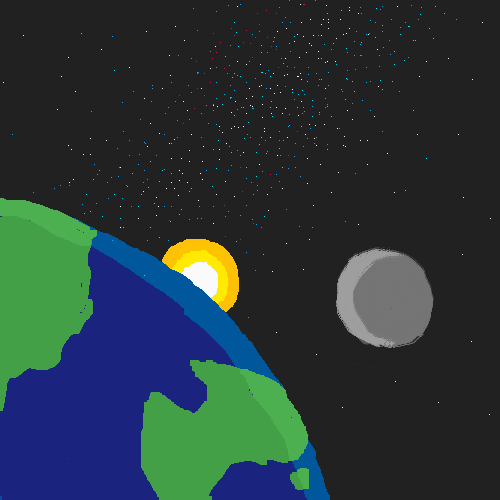

# Lesson 07

## WIP - Just an outline for now

In this lesson we're going to make two changes:
1. We'll add a more interesting background to give the game more visual appeal.
2. We'll introduce the concept of points to make the game more exciting: we'll give the player points for each asteroid they dodge and display their total score in the status bar.

[Add link to initial code - should just be final code of the last lesson]

# Changing the Background
Currently, the background of our game is a uniform blue color. We implemented this [way back in Lesson 02](../02/firstgame.py) using `screen.fill()` in our `draw()` function:

```python
def draw():
    screen.fill((0, 102, 255))
    ...
```

Remember that the argument to `screen.fill()`, the tuple `(0, 102, 255)` represents a color by specifying amounts of red, green, and blue to mix. The particular values we chose have given us the blue color you see when you play the game.

We'll give the game more visual appeal now by replacing this solid color background with an image:

<p align="center">
  
</p>

<p align="center"><i>Artist credit: Johar Singh</i></p>

Download the [cosmic-background.png](cosmic-background.png) file from this lesson's directory and place it in your Mu editor's images folder (as described in [Lesson 03](../03/README.md#mu-images) [TODO: Verify this link to an anchor works on github]).

Now, replace the `screen.fill()` call in your `draw()` function with a call to `screen.blit()`, as shown in the code shown below:

<pre>
def draw():
    <del>screen.fill((0, 102, 255))</del>
    <b>screen.blit("cosmic-background", (0, 0))</b>
    alien.draw()
    ...
</pre>

Arguments are name of the image and a tuple representing (left, top).

Explain: "blit" is short for "bit block transfer" and has [origins that go way back in the history of computing](https://en.wikipedia.org/wiki/Bit_blit).

# Implementing Points

Objective of the game is to dodge asteroids. We'll give points for each one that you dodge.

Define dodge: asteroid has moved past the alien without colliding.

General strategy:
- define global variable to hold score
- draw the score in the status bar i.e. what's in the variable
- every time an asteroid passes without colliding, add points to the score variable. next time it gets drawn it'll reflect the new score.

Define global variable:
<pre>
...
alien = Actor("alien")
alien.pos = 100, 56

alien_y_speed = 0
lives = 3
alien_can_hurt = True
<b>score = 0</b>
...
</pre>

Draw the score:

<pre>
def draw():
    ...

    # Draw status bar
    screen.draw.filled_rect(status_bar, (0, 20, 150))

    <b># Draw score
    screen.draw.text(str(score), topleft=(status_bar.left+10, status_bar.top+5), fontsize=20)</b>

    if lives <= 0:
        screen.draw.text("Game Over", center=(250, 150), fontsize=60)
        return
    ...
</pre>

Note: important to draw score above the check for lives <= 0 so that we see the score on game over.

Run it now: you should see a score displayed on the left of the status bar but it should always be zero because we're not updating it yet.

Now let's add to the score when an asteroid passes the alien.

[Annotate asteroids-passing.png in Projects/CCC/Lesson07 to show relative position of asteroid.right and alien.left to explain passing]

We move the asteroids in `update()` so that's the right place to check if an asteroid has moved past the alien and update the score.

<pre>
def update():
    global lives
    global alien_can_hurt
    <b>global score</b>

    ...

    for asteroid in asteroids:
        ...
        if alien.colliderect(asteroid) and alien_can_hurt:
            alien.image = "alien_hurt"
            lives -= 1
            print("Decreased lives to: " + str(lives))
            alien_can_hurt = False
            # sounds.eep.play()
            clock.schedule_unique(set_alien_normal, 2.0)

        <b>if asteroid.right < alien.left:
            score += 10</b>
</pre>

Because `score` is a global variable and we're changing that variable in this function, we need the `global score` declaration at the top. [TODO: link to earlier place where global variables were explained].

Next, we check if the asteroid's right-hand side has moved to the left of the alien's left-hand side (our definition of passing), and add 10 to the score if so.

Run it and see what happens. Score should jump way too fast.

Can you figure out why? Hint: it's a very similar issue to the one we debugged with decreasing lives on asteroid collision [TODO: link to "Debugging" section of Lesson 05].

To fix, we need to only add points the first time the asteroid has passed the alien.

Explain: can do this by remembering which asteroid's we've given points from before. But easier way is to make the asteroid's themselves carry a certain number of points and take those points away on first passing.

<pre>
def makeAsteroid(left, top):
    asteroid = Actor("asteroid")
    asteroid.left = left
    asteroid.top = top
    <b>asteroid.points = 10</b>
    return asteroid
</pre>

Explain about how we can add variables to an object

Change points assignment logic as follows:

<pre>
def update():
    ...

    for asteroid in asteroids:
        ...

        if asteroid.right < alien.left:
            <del>score += 10</del>
            <b>score += asteroid.points
            asteroid.points = 0</b>
</pre>

Two other changes needed:
1. When the asteroid goes off the screen to the left, reset its points when bringing it back on the right.
2. When an asteroid collides with the alien, take away its points otherwise we'd be getting points for asteroids we collided with.

<pre>
def update():
    ...

    for asteroid in asteroids:
        asteroid.left -= 2
        if asteroid.right < play_area.left:
            asteroid.left = play_area.right
            asteroid.top = randint(play_area.top, play_area.bottom-100)
            <b>asteroid.points = 10</b>

        if alien.colliderect(asteroid) and alien_can_hurt:
            <b>asteroid.points = 0</b>
            alien.image = "alien_hurt"
            lives -= 1
            print("Decreased lives to: " + str(lives))
            alien_can_hurt = False
            # sounds.eep.play()
            clock.schedule_unique(set_alien_normal, 2.0)

        if asteroid.right < alien.left:
            score += asteroid.points
            asteroid.points = 0
</pre>
